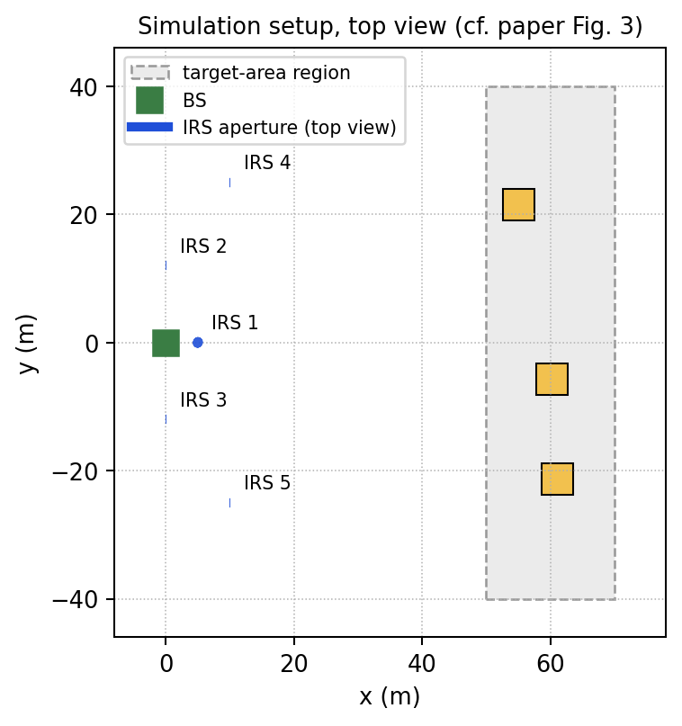
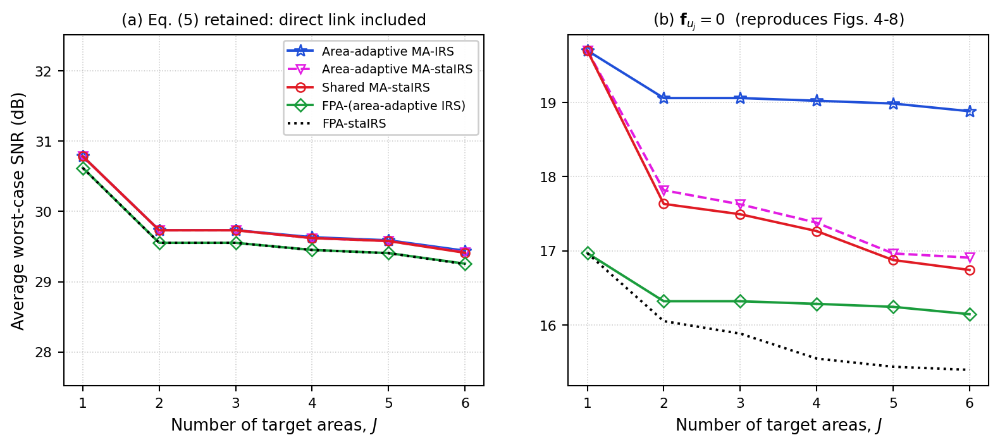
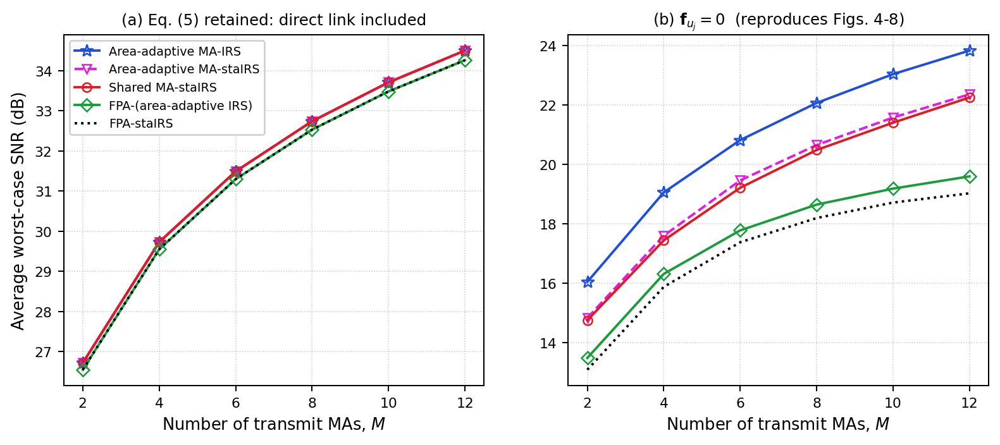
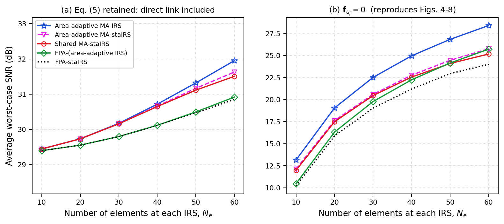
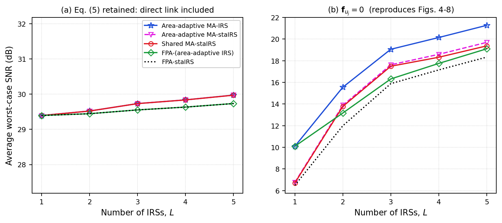
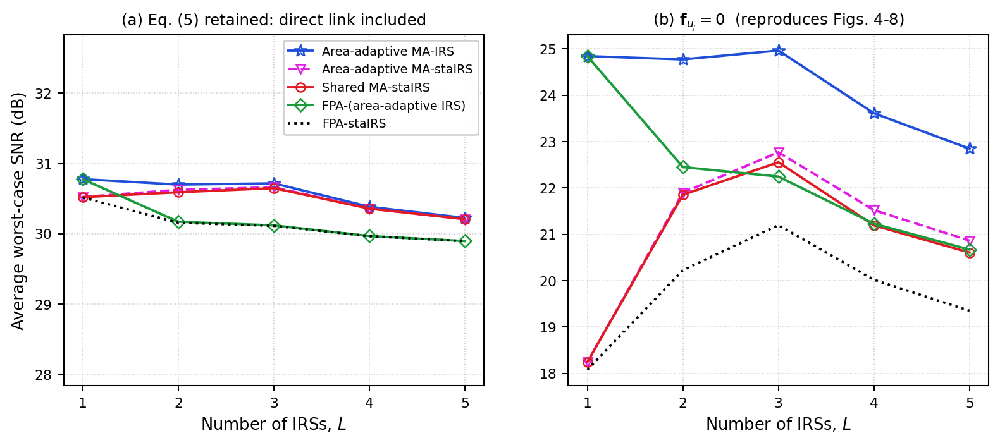
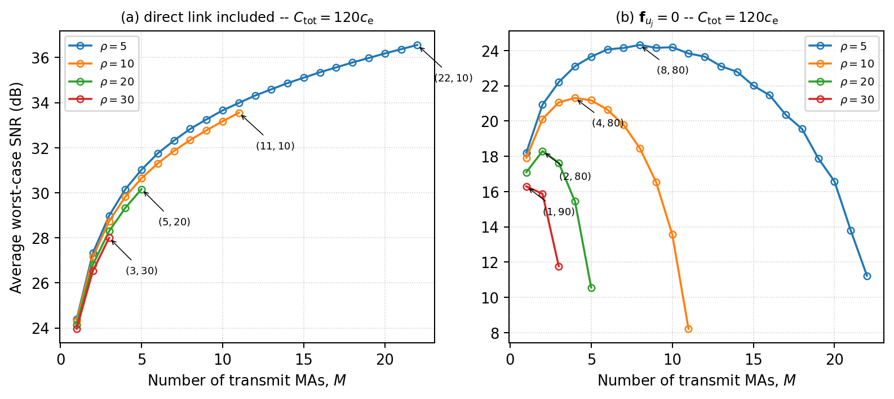
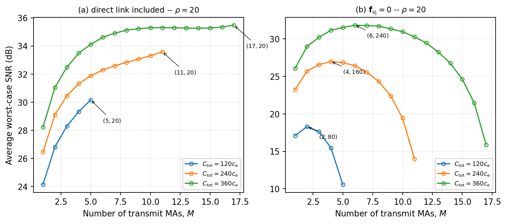

# MA-IRS Coverage Enhancement

Independent Python implementation and simulation study based on:

> Y. Gao, Q. Wu, W. Mei, G. Chen, W. Chen, and Z. Zheng,
> "Integrating Movable Antennas and Intelligent Reflecting Surfaces for Coverage Enhancement,"
> *IEEE Transactions on Wireless Communications*, 2026.

This repository contains an independently developed Python implementation of the movable antenna and intelligent reflecting surface (MA-IRS) based coverage enhancement system studied in the reference paper.

The implementation is intended for research, learning, simulation, and reproducibility purposes. It is **not an official implementation released by the paper authors**.

The original paper and its contents remain the property of their respective copyright holders.

---

## Overview

The implementation studies coverage enhancement using **Movable Antennas (MAs)** and **Intelligent Reflecting Surfaces (IRSs)**.

The simulation framework includes:

* Rician fading channel modeling
* Movable antenna positioning
* IRS phase-shift optimization
* Alternating Optimization (AO)
* Majorization-Minimization (MM) / surrogate-based updates
* Analytical SNR evaluation
* Monte Carlo channel validation
* Coverage-oriented simulation over multiple target areas
* Evaluation of multiple MA-IRS and fixed-position antenna configurations
* Numerical studies corresponding to the main simulation experiments in the reference paper

The implementation is designed to reproduce the **system behavior and qualitative trends** described in the reference paper under the documented simulation parameters and assumptions.

It should not be interpreted as an exact reproduction of every numerical value in the publication because several implementation details required for simulation are not explicitly specified in the paper.

---

## Implemented Schemes

The following five schemes are implemented:

1. **Area-adaptive MA-IRS**
2. **Area-adaptive MA-staIRS**
3. **Shared MA-staIRS**
4. **FPA-(area-adaptive IRS)**
5. **FPA-staIRS**

These schemes are evaluated under different numbers of target areas, transmit movable antennas, IRS elements, and IRS deployments.

---

## Optimization Framework

The implementation uses **Alternating Optimization (AO)** with MM/surrogate-based updates for the IRS phase shifts and movable antenna positions.

The optimization procedure alternates between the following blocks:

1. Optimize the IRS phase shifts.
2. Optimize the movable antenna positions.
3. Evaluate the resulting effective channel/SNR.
4. Repeat until the optimization procedure reaches the configured stopping condition.

The IRS update uses a first-order surrogate/lower-bound formulation corresponding to the optimization treatment in the reference paper.

The movable antenna update uses the corresponding surrogate formulation with the curvature bound described in the paper.

### Important Note

The final implementation does **not** use Block Coordinate Descent (BCD) as the main optimization method.

The optimization framework used in this repository is:

> **Alternating Optimization (AO) with MM/surrogate-based updates.**

---

## System Model

The considered system contains:

* A multi-antenna base station
* One or more intelligent reflecting surfaces
* Movable transmit antennas
* Multiple target areas
* User locations sampled within the target areas

The effective received signal is modeled through the cascaded:

**BS → IRS → User**

channel together with the IRS phase shifts and movable antenna configuration.

The implementation also contains the direct BS-user channel component corresponding to the system model in the reference paper.

---

## Channel Model

The BS-to-IRS and IRS-to-user links are modeled using **Rician fading**.

The channel model incorporates:

* Large-scale path loss
* Line-of-sight components
* Non-line-of-sight components
* Rician fading
* IRS phase shifts
* Movable antenna geometry
* BS antenna geometry
* IRS element geometry
* Distance-dependent propagation

The implementation contains both analytical channel/SNR calculations and Monte Carlo channel realizations.

---

## Simulation Parameters

The main numerical parameters follow the simulation setup described in Section IV of the reference paper.

| Parameter                      |              Value |
| ------------------------------ | -----------------: |
| Carrier frequency              |              3 GHz |
| Wavelength                     |              0.1 m |
| Reference path-loss constant   | $(\lambda/4\pi)^2$ |
| IRS path-loss exponent         |                2.2 |
| Direct-link path-loss exponent |                3.5 |
| Rician factor                  |               3 dB |
| Transmit power                 |             40 dBm |
| Noise power                    |            -90 dBm |
| Number of BS antennas          |                  4 |
| Minimum MA spacing             |        $\lambda/2$ |
| IRS element spacing            |        $\lambda/2$ |
| Number of target areas         |                  3 |
| Target-area sampling interval  |                1 m |

Parameters explicitly specified by the paper are used as the basis of the implementation.

Parameters that are not explicitly specified are documented separately in the `ASSUMPTIONS` configuration of the source code.

---

## Target Areas

The target areas are modeled in the horizontal plane.

The simulation region uses:

* $x \in [50,70]$ m
* $y \in [-40,40]$ m
* $z = 0$

Each target area has dimensions:

**5 m × 5 m**

The target areas are sampled at a **1 m spatial interval** for the coverage/SNR evaluation.

The implementation therefore evaluates the received SNR over a discrete set of user locations within the target regions.

---

## IRS Locations

The implementation uses the following IRS reference locations corresponding to the configurations considered in the simulation:

```text
[5, 0, 12]
[0, 12, 5]
[0, -12, 5]
[10, 25, 5]
[10, -25, 5]
```

The IRS geometry and orientation details that are not explicitly specified in the reference paper are handled through documented implementation assumptions.

---

## Direct-Link Treatment

The system model includes the direct BS-user link corresponding to Eq. (5) of the reference paper.

For the main numerical simulations corresponding to the coverage/SNR figures, the implementation uses:

```text
f_uj = 0
```

through the configuration:

```python
ASSUMPTIONS["include_direct"] = False
```

This corresponds to the blocked direct BS-user link treatment used for the main simulations.

The implementation retains the ability to enable the direct-link component for diagnostic and verification purposes.

Therefore, the direct-link treatment is configurable rather than permanently removed from the implementation.

---

## Analytical SNR Evaluation

The implementation evaluates the analytical SNR corresponding to the system formulation and Proposition 1 of the reference paper.

The SNR calculation incorporates the effective cascaded BS-IRS-user channel and the optimized IRS and movable antenna configurations.

The analytical formulation is used to evaluate system performance over the target-area user locations.

---

## Monte Carlo Validation

A Monte Carlo validation mode is included to compare the analytical SNR formulation with numerical channel realizations.

Run:

```bash
python3 ma_irs_coverage_enhancement.py --check
```

The validation generates random channel realizations according to the implemented Rician channel model and compares the resulting numerical behavior against the analytical formulation associated with Proposition 1 (Eq. 11).

This provides an independent numerical check of the implemented channel/SNR model.

---

## Numerical Results

The repository contains simulation figures corresponding to the main numerical experiments implemented from the reference paper.

### Figure 3 — Simulation Setup

The simulation setup illustrates the considered deployment geometry, target areas, IRS locations, and antenna configuration.



---

### Figure 4 — SNR versus Number of Target Areas

This experiment evaluates the effect of the number of target areas/configuration parameter $J$ on the achievable SNR.



---

### Figure 5 — SNR versus Number of Transmit MAs

This experiment evaluates the impact of the number of transmit movable antennas on the system performance.



---

### Figure 6 — SNR versus Number of IRS Elements

This experiment evaluates the effect of the number of IRS elements on the achievable SNR.



---

### Figure 7(a) — SNR versus Number of IRSs

This experiment evaluates the effect of the number of deployed IRSs under the corresponding IRS-element configuration.



---

### Figure 7(b) — Fixed Total Number of IRS Elements

This experiment evaluates the system when the total number of IRS elements is fixed while the number of IRSs varies.



---

### Figure 8(a) — Cost Tradeoff

This experiment evaluates the corresponding performance/cost tradeoff between the considered configurations.



---

### Figure 8(b) — Cost Tradeoff

The corresponding cost-performance comparison is shown below.



---

## Convergence and Additional Diagnostics

The implementation also contains additional diagnostic functionality for studying optimization behavior and configuration selectivity.

The available figure options include:

```text
3
4
5
6
7
8
conv
sel
all
```

where:

* `conv` generates the optimization convergence diagnostic.
* `sel` generates the configuration/selectivity diagnostic.
* `all` generates the complete set of supported figures.

---

## Running the Code

### 1. Clone the Repository

```bash
git clone https://github.com/UjwalRoop13/MA-IRS-Coverage-Enhancement.git
cd MA-IRS-Coverage-Enhancement
```

### 2. Install Dependencies

Python 3 is required.

Install the required packages:

```bash
pip install -r requirements.txt
```

The implementation currently requires:

```text
numpy
matplotlib
```

---

## Generate Individual Figures

### Figure 3

```bash
python3 ma_irs_coverage_enhancement.py --fig 3
```

### Figure 4

```bash
python3 ma_irs_coverage_enhancement.py --fig 4
```

### Figure 5

```bash
python3 ma_irs_coverage_enhancement.py --fig 5
```

### Figure 6

```bash
python3 ma_irs_coverage_enhancement.py --fig 6
```

### Figure 7

```bash
python3 ma_irs_coverage_enhancement.py --fig 7
```

### Figure 8

```bash
python3 ma_irs_coverage_enhancement.py --fig 8
```

---

## Generate All Figures

To run the complete numerical evaluation:

```bash
python3 ma_irs_coverage_enhancement.py --fig all
```

A smaller number of Monte Carlo trials can be specified for faster testing:

```bash
python3 ma_irs_coverage_enhancement.py --fig all --trials 8
```

The number of trials can be increased for more extensive numerical evaluation.

---

## Analytical / Monte Carlo Check

Run:

```bash
python3 ma_irs_coverage_enhancement.py --check
```

This executes the analytical/Monte Carlo validation mode.

---

## Optional Output Controls

The implementation also supports options for opening generated figures and related development workflows.

For the complete list of available command-line options:

```bash
python3 ma_irs_coverage_enhancement.py --help
```

---

## Output and Cache

Generated simulation figures are written to:

```text
figs2/
```

Simulation cache data are stored in:

```text
cache2/
```

The cache is ignored by Git through `.gitignore`.

This prevents generated simulation data from unnecessarily becoming part of the repository history.

---

## Reproducibility

The implementation is structured so that the main simulation parameters, assumptions, optimization configuration, and numerical settings can be inspected and modified directly in the Python source.

The repository also provides:

* `requirements.txt` for Python dependencies
* `CITATION.cff` for software citation
* `LICENSE` for licensing
* `.gitignore` for generated files
* Simulation figures for visual comparison

The implementation is intended to make the simulation workflow transparent rather than treating unspecified parameters as hidden implementation details.

---

## Implementation Assumptions

Several quantities required to implement the complete simulation are not explicitly specified in the reference paper.

These are collected and documented in the `ASSUMPTIONS` configuration in the source code.

The documented assumptions include:

* IRS panel geometry
* IRS panel orientations
* Active IRS subset selection for configurations with fewer IRSs
* Interpretation of the 1 m target-area sampling grid
* Monte Carlo trial count
* Optimization iteration and restart settings
* FPA axis
* Direct BS-user link treatment

These assumptions are explicitly exposed so that they can be modified and tested.

### Why this matters

Different implementation choices for unspecified parameters can lead to differences in the exact numerical values obtained from simulation.

Therefore, this repository focuses on providing an **independent, transparent implementation of the methodology** rather than claiming that every numerical value is an exact reproduction of the publication.

---

## Differences from an Exact Reproduction

The numerical results produced by this repository may differ from the published curves because of factors including:

* Parameters that are not explicitly specified in the paper
* IRS geometry assumptions
* IRS orientation assumptions
* Optimization initialization
* Optimization convergence
* Monte Carlo randomness
* Number of Monte Carlo trials
* Numerical tolerances
* Direct-link configuration
* Interpretation of target-area sampling
* Implementation-specific numerical details

These differences do not necessarily indicate an error in either implementation; they can arise when a paper does not provide every detail required to reproduce the original simulation environment exactly.

---

## Repository Structure

```text
MA-IRS-Coverage-Enhancement/
│
├── ma_irs_coverage_enhancement.py
│
├── requirements.txt
├── README.md
├── LICENSE
├── CITATION.cff
├── .gitignore
│
├── fig3_setup.png
├── fig4_vs_J.png
├── fig5_vs_M.png
├── fig6_vs_Ne.png
├── fig7a_vs_L_Ne20.png
├── fig7b_vs_L_N120.png
├── fig8a_cost.png
└── fig8b_cost.png
```

Generated simulation cache files are intentionally excluded from version control.

---

## Development and AI-Assisted Programming

AI-assisted programming tools were used during development for tasks including:

* Code generation assistance
* Debugging assistance
* Refactoring
* Code explanation
* Identification of implementation inconsistencies

The resulting implementation, simulation configuration, validation procedure, interpretation of the paper, and repository organization were reviewed and developed by the repository author.

The repository should therefore be considered an independently developed implementation and simulation study rather than an official software release associated with the reference paper.

---

## Limitations

This repository has several limitations.

### 1. Independent implementation

The code was developed independently and is not the official implementation from the paper authors.

### 2. Unspecified simulation details

Some simulation details required for an exact reproduction are not explicitly provided in the reference paper.

These are handled through documented assumptions.

### 3. Numerical differences

Exact numerical values may differ from the publication because of implementation details, initialization, random channel realizations, and numerical convergence.

### 4. Simulation-based evaluation

The repository focuses on the simulation methodology and numerical evaluation described in the paper. It does not constitute a hardware implementation or experimental measurement platform.

### 5. Model assumptions

The channel, geometry, optimization, and deployment assumptions are simulation-level models and should not automatically be interpreted as hardware-validated results.

---

## Research Use

This implementation can be used as a starting point for further research involving:

* Movable antennas
* Intelligent reflecting surfaces
* MA-IRS systems
* Coverage enhancement
* IRS phase optimization
* Antenna-position optimization
* Rician fading channels
* Alternating Optimization
* Majorization-Minimization
* Wireless channel modeling
* Simulation-based wireless communications research

Researchers extending this implementation should clearly distinguish their modifications from the original reference-paper methodology.

---

## Possible Extensions

The current framework can serve as a basis for investigating additional research directions, such as:

* Imperfect channel state information
* Channel estimation errors
* Mobility constraints
* Antenna movement/switching delays
* Discrete IRS phase shifts
* Hardware impairments
* More realistic IRS element models
* Multi-user systems
* Multi-cell deployments
* Joint communication and sensing
* Energy-efficiency optimization
* Robust optimization under channel uncertainty

These extensions are **not part of the current implementation** unless explicitly implemented in the source code.

---

## Reference

Y. Gao, Q. Wu, W. Mei, G. Chen, W. Chen, and Z. Zheng,

"Integrating Movable Antennas and Intelligent Reflecting Surfaces for Coverage Enhancement,"

*IEEE Transactions on Wireless Communications*, 2026.

---

## Citation

If you use this implementation or build upon this repository, please cite both the original paper and this software implementation where appropriate.

Repository citation information is provided in:

```text
CITATION.cff
```

### Original Paper

```text
Y. Gao, Q. Wu, W. Mei, G. Chen, W. Chen, and Z. Zheng,
"Integrating Movable Antennas and Intelligent Reflecting Surfaces
for Coverage Enhancement,"
IEEE Transactions on Wireless Communications, 2026.
```

### This Repository

```text
Ujwal Roop Bhogavilli,
"MA-IRS Coverage Enhancement: An Independent Python Implementation,"
2026.
```

---

## License

This project is released under the **MIT License**.

See [`LICENSE`](LICENSE) for the complete license text.

The MIT License applies to the original code contained in this repository.

It does not transfer or modify the copyright of the reference paper or other third-party material.

---

## Disclaimer

This repository is an independently developed implementation and simulation study based on the reference paper.

It is:

* **Not an official implementation**
* **Not affiliated with the paper authors**
* **Not endorsed by the paper authors**
* **Not released by the IEEE or the paper publisher**

The reference paper should be consulted for the original theoretical formulation, assumptions, and published results.

The implementation is provided for research, educational, and simulation purposes.

---

## Acknowledgment

The author acknowledges the researchers whose work is cited in the reference paper and whose published methodology forms the basis for this independent implementation.

---

## Author

**Ujwal Roop Bhogavilli**

Independent research implementation in wireless communications and intelligent radio environments.

GitHub:

https://github.com/UjwalRoop13

Repository:

https://github.com/UjwalRoop13/MA-IRS-Coverage-Enhancement
